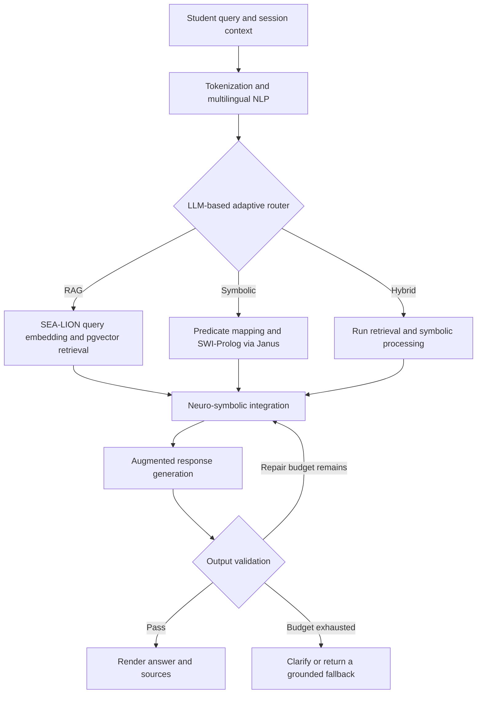

# Bintanong: End-to-End Implementation Plan

**Status:** Proposed build plan; no pipeline components have been implemented by this document.\
**Prepared:** 19 September 2026.\
**Target:** PalSU's web-based, read-only, neuro-symbolic RAG academic guide for undergraduate curriculum and institutional-policy queries.\
**First development milestone:** Docker-based project setup and component compatibility checks.

## 1. Source authority and project boundaries

This plan follows the supplied thesis, the supplied runtime architecture diagram, and the explicit correction that **Bintu-1 itself performs LLM-based query routing into RAG, Hybrid, or Symbolic paths**. English, Tagalog/Filipino, and Taglish interpretation are part of that pipeline. There is no separate lightweight routing classifier to train or deploy.

### 1.1 Source register

| ID | Source                                                                         | How it governs this plan                                                                                                                    |
| -- | ------------------------------------------------------------------------------ | ------------------------------------------------------------------------------------------------------------------------------------------- |
| U  | Current project instructions                                                   | LLM-based routing; Docker immediately; separate implementation phases; Supabase for vector storage.                                         |
| D  | `bintanong_full_runtime_routing_architecture.png`                              | Runtime component order, three processing paths, neuro-symbolic integration, response generation, output validation, and regeneration loop. |
| T  | `bintanong_thesis_for_context.pdf`                                             | Project scope, institutional evidence, named technologies, private-file boundaries, hardware, evaluation, and deployment intentions.        |
| R  | Primary research and official technical references linked throughout this plan | Supporting implementation details and methodological comparisons; these do not supply PalSU policies or replace the selected architecture.  |

**Precedence:** U overrides older thesis routing descriptions. D governs the current runtime flow. T supplies the remaining requirements. Engineering details that the sources do not specify are explicitly proposed here.

All thesis page references below mean **PDF page positions, counting the title page as page 1**, not table-of-contents page numbers. The supplied PDF has 88 pages; its table of contents references a longer manuscript and its Chapter II is omitted. The separate runtime PNG is therefore especially important as an architecture reference.

### 1.2 Requirements that remain fixed

- Support undergraduate academic and institutional guidance for the 2026–2027 study scope, through a web interface. [T, pp. 17–20]
- Use authorized PalSU documents for institutional claims: Student Handbook, Citizens' Charter, USG policies, CSG policies, and verified curriculum material needed for curriculum questions. [T, pp. 17, 55–56, 68–75]
- Preserve Bintu-1, SEA-LION embeddings, Supabase/PostgreSQL/pgvector, SWI-Prolog through Janus, Docling, FastAPI, Next.js, Vercel AI SDK, shadcn/ui, and Tailwind CSS. [T, pp. 76–79; D]
- Use top-k nearest-neighbor retrieval with cosine similarity. [T, pp. 30–36]
- Keep institutional updates under researcher/authorized-personnel control. Ordinary conversations and private uploads never update institutional knowledge or model weights. [T, pp. 7, 17–19]
- Support private PDFs and photographs as session-specific context, with isolation and no automatic institutional indexing. [T, pp. 18–19, 55, 65–66]
- Remain advisory: no university-database integration, enrollment transactions, grade changes, or issuance of official documents. [T, pp. 18, 66]
- Evaluate correctness, unsupported answers, retrieval, multilingual handling, private-file safeguards, usability, and acceptance. [T, pp. 13–15, 68–73]

The supplied thesis and diagram describe the system; they are **not the authoritative operational policy corpus**. The current attachments do not establish actual PalSU grade thresholds, prerequisite relationships, fees, deadlines, or exception rules. Those require the original authorized institutional documents.

### 1.3 Explicit implementation resolutions

| Source issue                                                                                                                    | Resolution for this build                                                                                                                                                                                |
| ------------------------------------------------------------------------------------------------------------------------------- | -------------------------------------------------------------------------------------------------------------------------------------------------------------------------------------------------------- |
| Older routing descriptions differ from the current request.                                                                     | Bintu-1 performs semantic interpretation and route selection. Deterministic schema checks validate its output; they do not replace it with a classifier. [U; D]                                          |
| Thesis processing prose describes generation before symbolic validation.                                                        | Follow D: obtain symbolic results where required, integrate evidence, generate, then validate the output. [T, p. 59; D]                                                                                  |
| Some thesis prose suggests passing sentence vectors to the LLM.                                                                 | SEA-LION vectors are used for retrieval. Bintu-1 receives query text, retrieved text, structured facts, and symbolic results through its own tokenizer. [T, pp. 36, 53–54]                               |
| The example Prolog rule treats unproven completion as false.                                                                    | Retain the prohibition on approving unproven eligibility, but distinguish `unknown` from a proven `ineligible` result in the advisory response. Missing data causes clarification. [T, pp. 20, 41–44]    |
| A naive universal-prerequisite check can succeed for an unknown course with no recorded prerequisites.                          | Require a recognized course, applicable curriculum version, and explicit rule-coverage status before evaluating eligibility.                                                                             |
| The stack table mentions student-related relational data, while the ethics section prohibits storing personal academic records. | Persist institutional curriculum data only. Handle student facts and private files transiently within the authorized session. [T, pp. 65–66, 77]                                                         |
| The thesis groups institutional documents as three or four documents in different places.                                       | Track each document, issuer, version, and scope individually; USG and CSG remain distinguishable. [T, pp. 66–70, 74–75]                                                                                  |
| Document-authorization prose is inconsistent about formal approval.                                                             | Follow the stated acquisition procedure on pp. 75–76: record issuing-office verification/authorization before activating institutional material. This is a project workflow, not a new legal conclusion. |
| Guarantees of correctness and an OCR accuracy `[X]%` appear in the manuscript.                                                  | Treat these as unverified claims/placeholders. Measure performance; never equate valid Prolog execution, a vector match, or RAGAS scores with universal correctness. [T, pp. 11, 37, 58, 72]             |
| Full pipeline versus raw Bintu-1 measures several changes simultaneously.                                                       | Preserve that required comparison and add a controlled RAG-only ablation to estimate the symbolic layer's contribution. [T, pp. 13–15]                                                                   |

## 2. Technology baseline

These are the **versions named in the thesis**, not a claim that they have already been installed together or verified as compatible. Phase 0 must resolve exact package versions, model revisions, quantization, runtime dependencies, and container image digests into lockfiles. Any necessary version adjustment must be recorded with its reason and compatibility evidence; do not silently substitute technologies.

| Component             | Thesis selection                                         | Implementation responsibility                                                                                                           |
| --------------------- | -------------------------------------------------------- | --------------------------------------------------------------------------------------------------------------------------------------- |
| Backend language      | Python 3.13.4                                            | FastAPI pipeline, data preparation, adapters, evaluation.                                                                               |
| API                   | FastAPI 0.136.1                                          | Request validation, session context, orchestration, response transport.                                                                 |
| Frontend              | Next.js 16.2.6                                           | Browser application and server-side API boundary.                                                                                       |
| UI transport/state    | Vercel AI SDK 6.0.177                                    | Chat state and a tested transport adapter to FastAPI.                                                                                   |
| UI components         | shadcn/ui 4.2.0; Tailwind CSS 4.2.4                      | Chat, uploads, citations, clarification, and status displays. Verify what the shadcn version denotes when locking generated components. |
| Institutional storage | Supabase; PostgreSQL 17 with pgvector                    | Document metadata, text chunks, embeddings, curriculum relations, rule provenance, and release metadata.                                |
| Symbolic engine       | SWI-Prolog 10.1.6 through Janus                          | Execute approved rules through a typed Python interface. Janus has its own dependency/version compatibility to verify.                  |
| Generative model      | Bintu-1: quantized Google Gemma 4 E4B                    | Multilingual interpretation, route selection, and evidence-constrained response generation.                                             |
| Embedding model       | SEA-LION-Embedding-E5-600M                               | Document and query embeddings in one shared vector space.                                                                               |
| Parsing/OCR           | Docling 2.93.0                                           | Institutional PDFs/poster photographs and isolated private uploads.                                                                     |
| Local hardware        | i7-12650H; 32 GB RAM; RTX 4060 Laptop GPU with 8 GB VRAM | Actual compatibility and memory/latency measurement target.                                                                             |
| Hosting intention     | Vercel and Supabase                                      | Web deployment and hosted database; backend/model compute requires a verified deployment configuration.                                 |
| Containerization      | Docker and Docker Compose                                | Added immediately by U, covering development, jobs, testing, and backend packaging.                                                     |

Source: [T, pp. 20, 76–79; U].

Two identifiers need precise handling:

- **SEA-LION:** the publisher's repository identifier is `aisingapore/SEA-LION-E5-Embedding-600M`. Its model card specifies **1,024 dimensions** and a **512-token context limit**. Preserve the thesis terminology in project prose, while using the exact repository identifier in configuration. [AI Singapore model card](https://huggingface.co/aisingapore/SEA-LION-E5-Embedding-600M)
- **Bintu-1:** `google/gemma-4-E4B-it` is a verified instruction-tuned E4B checkpoint candidate. Selecting its exact revision and quantized artifact is a Phase 0 engineering decision because the thesis does not identify them. Use the same chosen artifact in the raw-model and pipeline evaluation conditions. The official card documents Transformers-based loading. [Google model card](https://huggingface.co/google/gemma-4-E4B-it)

Model support for a language is a reason to evaluate it, not proof that Taglish routing or PalSU terminology will work reliably.

## 3. Architecture to implement

### 3.1 Institutional preparation, performed outside student requests

| Stage                        | Input                                              | Durable output                                                                             |
| ---------------------------- | -------------------------------------------------- | ------------------------------------------------------------------------------------------ |
| Acquisition and verification | Official documents and issuing-office confirmation | Source manifest and original document versions.                                            |
| Ingestion                    | PDF, scanned pages, authorized photographs         | Docling output, cleaned text, table structure, source spans, reviewed chunks.              |
| Embedding                    | Reviewed chunks                                    | Versioned SEA-LION embedding artifacts.                                                    |
| Vector storage               | Embedding artifacts and metadata                   | Supabase records, pgvector values, and searchable release membership.                      |
| Rule authoring               | Verified policy/curriculum spans                   | Reviewed structured facts, rule definitions, and compiled Prolog artifacts.                |
| Release activation           | Validated vector corpus and rule bundle            | One active knowledge-release ID linking compatible document, embedding, and rule versions. |

Embedding text does not create symbolic rules. Rule extraction and approval are a separate workstream with explicit provenance.

### 3.2 Student request flow

The diagram below preserves the supplied routing structure. Request/session validation and clarification exits are implemented around it.



Route names describe which evidence-processing paths execute. Even the **Symbolic** route still uses Bintu-1 for initial interpretation/routing and, when appropriate, final explanation. It bypasses vector retrieval, not necessarily all LLM calls.

### 3.3 Route semantics

| Route    | Select when                                                                                                                  | Required evidence                                                         | Important boundary                                                                       |
| -------- | ---------------------------------------------------------------------------------------------------------------------------- | ------------------------------------------------------------------------- | ---------------------------------------------------------------------------------------- |
| RAG      | Answering an institutional explanation or procedure from documents, without deciding a structured condition about a student. | Relevant authorized source passages.                                      | A question mentioning a policy is not automatically Symbolic.                            |
| Symbolic | A supported predicate can answer the question using approved rules and sufficiently complete scoped facts.                   | Applicable rule bundle, required input facts, and rule-source references. | An unsupported predicate or missing fact cannot be converted into an affirmative answer. |
| Hybrid   | The question needs both a rule-based decision and a document-based explanation or procedure.                                 | Retrieval evidence plus symbolic results from the same knowledge release. | Both required components must complete successfully before giving the combined decision. |

**Illustrative routing questions, not asserted PalSU rules:**

- RAG: “Ano ang process para humingi ng copy of grades?”
- Symbolic: “Can I take this course given these completed prerequisites?”
- Hybrid: “Bumagsak ako sa prerequisite; alin ang affected, at ano ang documented next step?”

Missing context, greetings, unsupported scope, and unavailable evidence are **control outcomes**, not a fourth substantive route. For a non-answerable request, `route` may be null while the control outcome specifies clarification or fallback. No institutional claim may bypass retrieval or approved symbolic evidence through a general-chat shortcut. [T, pp. 17–20, 59; U; D]

## 4. Delivery sequence

Each phase produces a reviewable artifact and an exit gate. Complete one bounded module at a time. This extends the thesis's iterative sprint approach without assuming its original sprint order is technically mandatory. [T, pp. 63–64]

| Phase | Workstream                            | Depends on | Reviewable result                                                     |
| ----- | ------------------------------------- | ---------- | --------------------------------------------------------------------- |
| 0     | Docker and compatibility              | Sources    | Reproducible project skeleton and component smoke checks.             |
| 1     | Source governance and contracts       | 0          | Source manifest, data contracts, and evaluation protocol draft.       |
| 2     | Data ingestion and chunking           | 1          | Reviewed, traceable text/chunk artifacts.                             |
| 3     | Embedding generation                  | 2          | Validated embedding artifacts independent of database writes.         |
| 4     | Supabase vector/relational storage    | 1, 3       | Migrations, ingestion loader, and release-aware storage.              |
| 5     | Retrieval                             | 4          | Tested cosine top-k retriever with citations and abstention handling. |
| 6     | Structured knowledge and Prolog       | 1, 2, 4    | Reviewed rule bundle and typed Janus interface.                       |
| 7     | Multilingual NLP and LLM routing      | 0, 1, 6    | Bintu-1 interpreter/router with evaluated route decisions.            |
| 8     | Runtime orchestration and integration | 5, 6, 7    | All three routes return a common evidence package.                    |
| 9     | Generation and output validation      | 8          | Validated answers and bounded regeneration.                           |
| 10    | Private-file pipeline                 | 2, 6, 7, 9 | Isolated PDF/image context with deletion and leakage checks.          |
| 11    | Complete web interface                | 9, 10      | Next.js student workflow connected to FastAPI.                        |
| 12    | System and thesis evaluation          | 5–11       | Reproducible benchmark results, safeguards evidence, SUS/UAT results. |
| 13    | Deployment and maintenance            | 12         | Verified deployment, rollback, and authorized update procedures.      |

The web shell and evaluation harness start earlier in Phases 0–1. Phases 11–12 complete their end-to-end behavior. Source acquisition may continue while infrastructure is built; a missing official policy blocks the corresponding answer capability, not unrelated infrastructure work.

## 5. Phase 0 — Docker immediately and compatibility first

**Purpose:** establish a buildable environment before feature implementation, especially for Python, Janus, native Prolog libraries, OCR dependencies, and local inference.

### 5.1 First repository commit

Create the following planned paths; these are future repository deliverables, not files supplied with this plan.

| Path                                            | Responsibility                                                                                    |
| ----------------------------------------------- | ------------------------------------------------------------------------------------------------- |
| `compose.yaml`                                  | Application services, networks, health checks, volumes, and tool jobs.                            |
| `compose.gpu.yaml`                              | GPU-specific override without changing application interfaces.                                    |
| `docker/api.Dockerfile`                         | Python, FastAPI, SWI-Prolog, Janus, and runtime orchestration.                                    |
| `docker/ingest.Dockerfile`                      | Docling and its selected OCR dependencies.                                                        |
| `docker/embedding.Dockerfile`                   | SEA-LION embedding runtime.                                                                       |
| `docker/bintu.Dockerfile`                       | Selected quantized Bintu-1 inference runtime.                                                     |
| `docker/web.Dockerfile`                         | Next.js development and production build stages.                                                  |
| `.dockerignore`, `.gitignore`, `.env.example`   | Exclude secrets, personal files, model weights, and transient data; document configuration names. |
| `supabase/config.toml`, `supabase/migrations/`  | Local Supabase configuration and versioned SQL.                                                   |
| `backend/app/`, `frontend/`, `knowledge/rules/` | Application and approved rule code.                                                               |
| `tests/`, `evaluation/`, `docs/decisions/`      | Verification, experiments, and explicit architectural decisions.                                  |
| Dependency manifests and lockfiles              | Reproducible Python and frontend dependencies.                                                    |

### 5.2 Container boundaries

| Service/job          | Runtime contents                                                         | Persistent data                                                   |
| -------------------- | ------------------------------------------------------------------------ | ----------------------------------------------------------------- |
| `web`                | Next.js, AI SDK, shadcn/ui, Tailwind                                     | None for personal chat content.                                   |
| `api`                | FastAPI orchestration and in-process Janus/SWI-Prolog bridge             | Approved read-only rule artifacts; no persistent student records. |
| `bintu`              | One resident selected model, internal inference interface                | Model cache only.                                                 |
| `embedding`          | One resident SEA-LION model and encode interface                         | Model cache only.                                                 |
| `ingest`             | Explicit one-shot institutional parsing/chunking/embedding/load commands | Authorized institutional preparation artifacts.                   |
| `evaluate`           | Reproducible benchmark runner using the same service interfaces          | Authorized/synthetic benchmark inputs and non-private results.    |
| Local Supabase stack | Managed by the pinned Supabase CLI using Docker                          | Institutional database and its development volumes.               |

Use the real local Supabase stack from the start, rather than creating a separate generic database and treating Supabase as a later migration. The CLI documents Docker-compatible local operation. Configure a named network shared with application containers and document the actual database/API endpoint names. Do not assume `localhost` inside `api` refers to the host database. [Supabase local development](https://supabase.com/docs/guides/local-development)

Keep SWI-Prolog and Janus together inside the Python runtime that invokes them. A separate Prolog network service would require a different integration design and is unnecessary for the selected Janus bridge.

### 5.3 Initial tasks

- [ ] Start local Supabase, enable/check pgvector, and confirm a containerized Python client can connect.
- [ ] Build each application image with pinned dependencies; record the installed PostgreSQL/pgvector versions and compare them with the intended deployment target.
- [ ] Verify Janus imports and executes a fixed, harmless Prolog query from inside `api`.
- [ ] Parse one clearly labeled synthetic PDF through Docling inside its container.
- [ ] Encode one English and one Tagalog/Taglish query through SEA-LION; assert vector dimensions and finite values.
- [ ] Load the selected quantized Bintu-1 artifact, run text generation, and exercise a small structured JSON response.
- [ ] Establish a thin inference adapter. A Transformers/PyTorch implementation is the initial candidate supported by the model card; freeze the compatible serving/quantization dependencies after the hardware check.
- [ ] Verify startup/readiness behavior and the frontend-to-FastAPI health connection.
- [ ] Test the GPU override on the actual development machine; retain a measured CPU fallback.
- [ ] Set model/request concurrency conservatively, initially one active Bintu-1 inference, with a bounded queue and explicit timeout response.
- [ ] Run embeddings and OCR on CPU initially where feasible, and schedule bulk ingestion separately from chat benchmarking. Measure before making both models and OCR compete for 8 GB VRAM.

GPU-enabled Compose services require host/runtime support and explicit device configuration; the override alone does not install a working GPU runtime. [Docker GPU guidance](https://docs.docker.com/compose/how-tos/gpu-support/)

Record model load time, peak RAM/VRAM, generation latency, tokenizer/chat-template behavior, and any offloading. “E4B” and quantization do not by themselves prove the complete workload fits the thesis hardware.

### 5.4 Development command contract

After implementing the scaffold, the project should expose documented commands equivalent to:

```bash
npx supabase start
docker compose up --build
docker compose --profile tools run --rm ingest --help
docker compose --profile tools run --rm evaluate --help
```

Pin the CLI locally, configure the shared network in the project bootstrap, and provide a separate documented GPU command using `compose.gpu.yaml`. These commands describe the intended interface; this plan does not claim they are executable before the repository is created.

**Exit gate:** another developer can build from lockfiles, start the containers, reach local Supabase, call Bintu-1, obtain a 1,024-dimensional embedding, parse a fixture, and run Janus without installing Python/Prolog manually on the host.

## 6. Phase 1 — Source governance, data contracts, and experiment design

**Purpose:** define what counts as institutional truth and how every component exchanges evidence.

### 6.1 Institutional source manifest

For each item, record document identity, issuing authority, title, document category, version/date, effective dates if explicitly documented, campus/college/program scope, source location, authorization/verification status, file hash, reviewer, and supersession relationship.

Acquire the Handbook, Citizens' Charter, USG and CSG documents through the thesis's named office workflow. Include verified curriculum/prospectus material before enabling curriculum-dependent rules. A prospectus uploaded by a student remains private context unless separately obtained and approved through institutional ingestion. [T, pp. 17, 55, 67–76]

Do not infer a university-wide policy from one college's document. Do not invent a hierarchy between conflicting sources. An effective date or authoritative replacement relationship must be evidenced; otherwise mark the conflict for source-owner review.

### 6.2 Shared contracts

Implement typed, versioned models for these boundaries:

| Contract                | Minimum fields                                                                                                                         |
| ----------------------- | -------------------------------------------------------------------------------------------------------------------------------------- |
| `SourceDocumentVersion` | Document/version IDs, issuer, scope, source location, hash, verification state, effective/supersession metadata.                       |
| `SourceSpan`            | Document version, PDF page position, printed page label when available, section/table locator, text, extraction provenance.            |
| `Chunk`                 | Chunk ID, source spans, content, section path, scope, token count, content hash, chunker version.                                      |
| `EmbeddingRecord`       | Chunk ID, model ID/revision, preprocessing/prompt configuration, dimension, normalization setting, vector.                             |
| `NormalizedQuery`       | Original text, minimally normalized text, language hints, intent, entity mentions/canonical IDs, ambiguities, session-fact references. |
| `RoutingDecision`       | Schema version, route or null, control outcome, predicate request if applicable, required/missing facts, brief route reason.           |
| `RetrievalResult`       | Knowledge-release ID, selected chunks, scores, source locators, coverage status, retrieval configuration.                              |
| `SymbolicResult`        | Status, predicate, inputs, satisfied/violated/unknown conditions, rule IDs, source spans, rule-bundle version.                         |
| `EvidenceBundle`        | Route, release ID, document evidence, symbolic result, scoped student facts, unresolved conflicts, permitted claims.                   |
| `AnswerEnvelope`        | Status, language, response text, structured decision fields, citations, validation result, request ID.                                 |

Student facts carry an origin such as `user_statement` or `private_upload`, an extraction/confirmation state, and session ownership. They must never be labeled verified university records.

### 6.3 Reproducibility and benchmark preparation

- Define the thesis's five evaluation categories separately: enrollment procedures, prerequisite eligibility, grade policies, academic standing, and disciplinary policies. [T, p. 71]
- Reserve at least 50 verified Taglish institutional questions for the final benchmark, targeting 10 per category as proposed in the thesis. Build a separate development set rather than tuning against these final cases. [T, pp. 68–71]
- Draft the route, evidence, symbolic-result, answer-correctness, and unsupported-claim annotation rubrics before implementation tuning.
- Keep all paraphrases, language variants, and near-identical scenarios in the same split. Sharing the institutional corpus across splits is expected; leaking test questions/answers into prompts is not.
- Track `code_version`, `prompt_version`, `model_revision`, `quantization`, `embedding_config`, `knowledge_release_id`, `rule_bundle_version`, and decoding parameters.

**Exit gate:** one document, one chunk, one rule, and one benchmark case can be traced to an exact source span; the contracts distinguish institutional evidence from private context and missing information.

## 7. Phase 2 — Data ingestion and chunking

**Purpose:** produce high-quality, source-linked text without coupling parsing to embedding or database writes.

### 7.1 Ingestion steps

1. Validate the institutional manifest entry and preserve the original document bytes.
2. Inspect whether the document contains usable text, scans, photographs, or mixed pages.
3. Convert through Docling with a pinned OCR backend and language configuration. Enable OCR where required; record the actual backend and settings.
4. Export structured document content, including headings, ordered procedures, tables, page locators, and relevant layout provenance.
5. Clean repeated headers/footers and extraction noise without rewriting policy meaning.
6. Preserve course-code punctuation, negation, numbers, dates, exceptions, units, and table row/column associations.
7. Review low-quality pages and all fields that will become executable rules.
8. Chunk by sections, policy clauses, procedures, and coherent table units.
9. Export versioned chunk artifacts and an ingestion report.

Do not paraphrase institutional text during canonical ingestion. A summary may be generated later from cited text; it must not replace the underlying source.

### 7.2 Chunking policy

**Proposed starting configuration:** aim for roughly 300–400 embedding tokens per chunk, with modest overlap only where a clause or procedure crosses a boundary. The hard cap must include any model prompt/prefix and special tokens within the verified 512-token embedding limit. Tune on the development set, not on final test results.

- Keep conditions, exceptions, and the rule they qualify together where possible.
- Repeat table headers when splitting a table into coherent row groups.
- Preserve parent-section references so adjacent context can be fetched without inventing missing text.
- Compute stable IDs from document version, source location, content hash, and chunker version.
- Treat duplicates within one release separately from new editions; do not discard a changed policy merely because most wording is identical.

### 7.3 Ingestion verification

The thesis names a 10-document OCR check but leaves its accuracy unresolved. Reproduce a documented check over 10 representative scanned documents, transcribe reference text manually, and report character error rate plus errors in critical fields such as course codes and numbers. A high average OCR score must not conceal a wrong prerequisite or grade value. [T, p. 58]

**Deliverables:** original institutional documents, Docling exports, source-span records, chunk artifacts, extraction settings, and an OCR/chunk-review report.

**Exit gate:** each sampled chunk resolves to the correct page/section, tables retain meaning, and no unreviewed critical extraction error reaches rule authoring. This phase succeeds without calling an embedding model or writing vectors.

## 8. Phase 3 — Embedding generation

**Purpose:** create reusable vector artifacts from approved chunks, independent of persistence and retrieval.

### 8.1 Embedding adapter

- Implement distinct `encode_documents()` and `encode_queries()` interfaces using the same pinned SEA-LION checkpoint.
- Load the model's own tokenizer/configuration; do not share Bintu-1 token IDs with the encoder.
- Inspect and lock the model's supported retrieval query/document prompt conventions. Its card's generic similarity example uses an STS prompt; do not assume that example is the correct retrieval configuration. Verify the pinned configuration before corpus encoding. [AI Singapore model card](https://huggingface.co/aisingapore/SEA-LION-E5-Embedding-600M)
- Apply L2 normalization consistently as intended by the thesis, and record that setting. [T, p. 29]
- Assert 1,024 dimensions, finite/nonzero vectors, correct token limits, and stable batch-to-record mapping.
- Batch on available memory, checkpoint completed batches, and resume failures without duplicating work.

The embedding artifact must include a configuration fingerprint covering model revision, prompt conventions, tokenizer, normalization, and chunker version. Query-time configuration must match it.

### 8.2 Verification and re-embedding rules

- Verify that manually paired English, Tagalog, and Taglish development questions retrieve plausible shared policy passages in an offline similarity check.
- Include hard negatives: similarly worded policies for a different program, college, or academic period.
- Check long inputs explicitly for truncation; divide multi-part queries into bounded retrieval subqueries when necessary while preserving the complete original text for interpretation.
- Re-embed only changed chunks when the configuration is unchanged.
- Create a new embedding set when model revision or encoding configuration changes. Do not silently mix vector spaces in one searchable release.

**Deliverables:** embedding adapter, batch command, vector artifacts, model/configuration manifest, and validation report.

**Exit gate:** the corpus can be embedded, interrupted, resumed, and validated without Supabase. No claim of multilingual accuracy is accepted merely because vector generation succeeds.

## 9. Phase 4 — Supabase vector and relational storage

**Purpose:** persist the reviewed corpus and approved structured knowledge with version control and restricted access.

### 9.1 Proposed logical schema

The exact SQL is a Phase 4 deliverable. The following schema is a concrete starting design rather than a table layout asserted by the thesis.

| Table/group                                                    | Stored information                                                                           |
| -------------------------------------------------------------- | -------------------------------------------------------------------------------------------- |
| `documents`, `document_versions`                               | Identity, issuer, scope, verification, version, hash, and original-source location.          |
| `source_spans`, `chunks`                                       | Source-linked text, locators, hierarchy, and chunker metadata.                               |
| `embedding_sets`, `chunk_embeddings`                           | Encoding fingerprint and `vector(1024)` values linked to chunks.                             |
| `programs`, `curriculum_versions`, `courses`, `course_aliases` | Authorized institutional entities and curriculum scope.                                      |
| `policy_rules`, `rule_source_spans`                            | Reviewed rule specification, applicability, coverage, provenance, and approval state.        |
| `knowledge_releases`, release-membership tables                | Exact document versions, embedding set, and rule-bundle artifact included in a release.      |
| `active_release`                                               | Atomically selected current release; prior validated releases remain available for rollback. |
| `ingestion_runs`, `evaluation_runs`                            | Institutional processing metadata and non-private experiment metadata.                       |

**No persistent ****`student_grades`****, transcripts, personal enrollment records, private-file embeddings, or personal chat transcripts in this schema.** This follows the thesis's stricter privacy requirement. [T, pp. 65–66]

### 9.2 Storage implementation

- [ ] Create versioned Supabase SQL migrations with foreign keys, uniqueness constraints, and constrained status values.
- [ ] Enable pgvector and verify the extension version on local and hosted databases.
- [ ] Implement an idempotent loader from the Phase 3 artifacts using staging records and explicit validation.
- [ ] Validate vector dimensions/configuration, document approval, source references, and row counts before activation.
- [ ] Separate the runtime read role from the ingestion/migration write role. Keep database credentials on the server.
- [ ] Configure table privileges and RLS where tables are exposed through Supabase APIs; test access with the actual runtime/client roles. A privileged administrative connection is not evidence that RLS works.
- [ ] Avoid placing an unrestricted service credential in the frontend or using it as the default student-request credential.
- [ ] Publish a complete knowledge release atomically; keep incomplete imports invisible to runtime queries.
- [ ] Retire superseded material from the current release without erasing historical provenance.

Start with exact cosine search for a measurable reference implementation. Add HNSW only after corpus size/latency measurements justify approximate search, and compare its recall against the exact baseline. pgvector supports both approaches and defines `<=>` as cosine distance. [pgvector documentation](https://github.com/pgvector/pgvector)

**Deliverables:** migrations, role/access policies, bulk loader, release activation/rollback commands, and database verification fixtures.

**Exit gate:** a second import produces no duplicates; staged or superseded chunks cannot leak into current retrieval; the runtime role cannot mutate institutional knowledge.

## 10. Phase 5 — Retrieval

**Purpose:** return relevant, authorized, source-linked context without depending on answer generation.

### 10.1 Retrieval algorithm

1. Receive a retrieval request with query text, canonical entity hints, authorized scope, and a pinned knowledge-release ID.
2. Embed the query with the matching SEA-LION configuration.
3. Apply verified release/scope filters. Unknown scope remains unknown; do not fabricate a college or curriculum filter.
4. Rank candidate chunks by ascending cosine distance and take the configured top-k candidates.
5. Deduplicate overlapping evidence and include required neighboring clauses within the context budget.
6. Apply a development-set-calibrated relevance/coverage policy; return insufficient evidence when appropriate.
7. Return text, source/version IDs, page/section locators, scores, and retrieval configuration.

The SQL distance operation is `embedding <=> query_vector`; cosine similarity is `1 - distance`. Scores are not probabilities of correctness. [pgvector documentation](https://github.com/pgvector/pgvector)

**Proposed initial tuning set:** compare `k = 3, 5, 8`, with a bounded context token budget. Do not fill an answer with irrelevant material just to return exactly k chunks. If fewer than k authorized/relevant chunks exist, return fewer and expose the evidence gap.

### 10.2 Scope and entity handling

Exact course-code and document metadata matching can narrow or check candidates before semantic ranking. This supports the thesis's vector retrieval; it does not introduce a second retrieval architecture.

If two curriculum versions are plausible and the answer differs, request the student's applicable curriculum information. If authoritative source versions conflict, preserve the conflict in the result. Similarity ranking is not a mechanism for deciding which policy has institutional authority.

### 10.3 Retrieval gate

Evaluate manually labeled development queries using Precision\@k, Recall\@k, and retrieval failure analysis, separated by language and policy category. Test unavailable policies, ambiguous acronyms, wrong-program matches, and outdated editions.

**Deliverables:** retrieval module, internal debug command/endpoint, configuration, labeled evidence fixtures, and retrieval report.

**Exit gate:** expected policy evidence is recovered on approved development cases, unsupported cases are detected, and every result has a resolvable citation. The gate runs without generating an LLM answer.

## 11. Phase 6 — Structured knowledge and SWI-Prolog reasoning

**Purpose:** turn verified institutional rules into a separately testable deterministic component.

### 11.1 Rule authoring pipeline

1. Identify a policy/curriculum clause that is sufficiently explicit to formalize.
2. Record its source span, applicable program/curriculum/period, conditions, exceptions, and expected decision scope.
3. Encode institutional entities and a reviewed structured rule specification.
4. Have the researcher and relevant policy/domain reviewer check the translation against the source.
5. Compile approved specifications to a versioned Prolog fact/rule bundle.
6. Run rule tests before including the bundle in a knowledge release.

Institutional relational records and reviewed rule specifications are the authoring source of truth. Generated Prolog artifacts are reproducible release outputs. Do not maintain two independently edited versions of the same prerequisite data.

If an LLM assists extraction, its result remains an unapproved draft. It must never install a rule or derive policy authority from a student-uploaded document.

### 11.2 Initial capabilities

Start with source-supported course prerequisite/dependency checks. Add credit thresholds, academic-standing conditions, retaking conditions, enrollment requirements, or other formalizable policies only when the corpus explicitly documents them. These are capability families named in the thesis, not assumed PalSU rules. [T, pp. 22, 39–44, 59]

Proposed typed operations include:

- `check_prerequisite_eligibility`
- `list_missing_prerequisites`
- `list_affected_courses`
- Additional policy-specific checks registered only after source review and tests.

Preserve the actual logical structure: all-of versus any-of prerequisites, explicit co-requisites, exceptions, or minimum values only if the source contains them. A flat list of edges is insufficient when a rule contains alternatives or exceptions.

### 11.3 Safe query construction through Janus

The LLM selects an allowed operation and supplies typed entity/fact arguments. Backend code resolves that operation to a **fixed Prolog goal with bound inputs**. Do not execute arbitrary Prolog text generated by the LLM or pasted into a query. Janus provides query APIs with input bindings suitable for this boundary. [SWI-Prolog Janus documentation](https://www.swi-prolog.org/pldoc/man?section=janus-call-prolog)

Load approved institutional rules as immutable release data. Pass student facts as request-local arguments; avoid globally asserting them into a shared knowledge base. Bound execution time and result counts. Use a controlled execution worker/lock arrangement and test Janus behavior under concurrent API requests before increasing concurrency.

### 11.4 Decision semantics

| Status        | Meaning                                                                                                            | Permitted response                                                                                             |
| ------------- | ------------------------------------------------------------------------------------------------------------------ | -------------------------------------------------------------------------------------------------------------- |
| `eligible`    | All conditions within the explicitly supported check are satisfied, with required facts and rule coverage present. | State the scoped result and its assumptions; do not imply official enrollment approval.                        |
| `ineligible`  | A documented condition is demonstrably unmet.                                                                      | Explain the unmet condition with rule/source references.                                                       |
| `unknown`     | Required facts, applicable curriculum, rule coverage, or authoritative resolution are missing.                     | Ask for the missing information or explain that eligibility cannot be established.                             |
| `unsupported` | The requested operation is outside the approved symbolic capability set.                                           | Use documented information for a limited explanation where appropriate; abstain from the unsupported decision. |
| `error`       | Reasoning failed operationally.                                                                                    | Report inability to complete the check; never convert an error into a policy outcome.                          |

Check known-course and rule-coverage preconditions before evaluating a universal prerequisite rule. Represent “verified no prerequisites” distinctly from “no prerequisites recorded.” Repeated course attempts, missing grades, exemptions, and equivalent courses need source-defined treatment; do not infer those rules.

### 11.5 Rule verification

Test complete eligibility, proven failure, missing records, unknown course, incorrect curriculum, explicit zero prerequisites, partial rule coverage, conflicting facts, and request isolation. Check prerequisite cycles and unresolved references during bundle compilation; flag them for review instead of repairing policy data automatically.

The thesis's CC3/L–CC4/L–CC5/L example may be used as a labeled illustrative fixture, never as a verified production prerequisite chain. [T, pp. 41–44]

**Deliverables:** reviewed rule ledger, structured institutional schema, Prolog bundle/compiler, Janus adapter, capability registry, and rule-level tests.

**Exit gate:** decisions and explanations are deterministic for fixed inputs and rules; unknown information never produces a false approval or an unsupported definitive denial.

## 12. Phase 7 — Multilingual NLP and LLM-based adaptive routing

**Purpose:** let Bintu-1 interpret the student's actual language and select the required processing path.

### 12.1 Interpretation sequence

1. Validate request size, text encoding, and session ownership.
2. Preserve the original utterance and apply minimal Unicode/whitespace cleanup.
3. Use Bintu-1's own tokenizer/chat template for its input limits; tokenize separately for SEA-LION when retrieval is needed.
4. Extract language hints, intent, entity mentions, negation, hypothetical versus asserted facts, and ambiguities.
5. Resolve institutional identifiers against approved aliases and scoped entities.
6. Have Bintu-1 select RAG, Hybrid, or Symbolic using the query, resolved context, and supported capability descriptions.
7. Validate the structured output and required arguments before dispatch.

Initially keep interpretation and routing as separately observable logical stages. They may share one Bintu-1 structured-output call to reduce overhead if their fields and validation remain distinct. That is an implementation optimization, not a return to a lightweight classifier.

### 12.2 Language handling

- Include development examples in English, Tagalog, Taglish, informal spelling, and code-switched phrasing.
- Preserve decisive words such as `hindi`, `di`, `pa`, `passed`, `failed`, and temporal qualifiers.
- Normalize a course-code alias only when the approved alias map resolves it uniquely.
- Treat ambiguous acronyms and missing curriculum/program information as clarification needs.
- Preserve the user's preferred language in the answer; do not force English translation as the only interpretation path.
- Keep user assertions separate from policy facts: “sabi ng friend ko puwede” is not a rule.

### 12.3 Router output

A proposed JSON shape is:

```json
{
  "schema_version": "1",
  "control": "proceed",
  "route": "Hybrid",
  "language": "Taglish",
  "intent": "eligibility_and_next_steps",
  "entities": [],
  "symbolic_operation": "check_prerequisite_eligibility",
  "missing_fields": [],
  "reason": "The request needs a prerequisite check and a documented procedure."
}
```

This example describes the contract; a real `proceed` decision must contain the required validated entities and facts. The runtime rejects inconsistent fields, unsupported operations, or unresolved identifiers. The brief `reason` is a routing explanation, not a request to store or expose unrestricted model reasoning.

Use schema-constrained decoding if the selected local runtime supports it. Otherwise parse and validate the response, permit one bounded format-repair attempt, and return clarification/unavailable when a valid decision cannot be obtained. A model-generated confidence number is not calibrated evidence of correctness.

### 12.4 Routing safeguards

- Do not choose a cheaper route merely because a required reasoning component is busy or unavailable.
- Do not silently convert a failed Symbolic/Hybrid request into an unconstrained RAG answer.
- Capability validation may reject an invalid route or request a bounded router reconsideration; it does not secretly implement a separate semantic classifier.
- If retrieval reveals that a requested decision requires a structured condition omitted by the initial route, recheck routing before generating the decision or return a limited explanation with the decision withheld.
- Select the route once per resolved request unless an explicit, bounded correction is required. Track reconsiderations.

**Deliverables:** versioned interpretation/router prompts, entity resolution, schema validation, multilingual fixtures, and a route-evaluation report.

**Exit gate:** report route confusion matrices and per-language results; equivalent language variants have consistent routes and entity meaning; missing facts and invalid outputs cannot enter symbolic execution unchecked.

## 13. Phase 8 — Orchestration and neuro-symbolic integration

**Purpose:** join the independent modules while keeping evidence, decisions, and failure states explicit.

### 13.1 Route executors

- **RAG executor:** query embedding, retrieval, and evidence-package construction.
- **Symbolic executor:** typed predicate mapping, Janus execution, and rule-source evidence construction. Source text may be fetched by exact provenance ID without vector search.
- **Hybrid executor:** invoke retrieval and symbolic processing, then wait for both required results. Execute concurrently only when their inputs are already available and independent; otherwise preserve the dependency order.

Implement the orchestrator as explicit Python control flow and typed adapters in FastAPI. The supplied sources do not require an additional agent framework, graph database, distributed queue, or orchestration platform.

### 13.2 Integration rules

1. Pin `knowledge_release_id` at request start and use it for both evidence paths.
2. Check that the rule bundle and retrieved documents belong to that release.
3. Distinguish institutional claims, derived symbolic decisions, and student-supplied context.
4. Give an applicable, successfully verified symbolic result control over the corresponding structured decision.
5. Preserve exceptions and applicability conditions in the generation evidence.
6. Treat a detected rule/document disagreement as a conflict requiring correction or abstention. Do not automatically trust an outdated encoded rule over contradictory authoritative text.
7. Restrict conclusions to the checks actually performed; a prerequisite check is not a complete enrollment or graduation determination.

The shared `EvidenceBundle` must contain the decision status, supporting spans, verified rule IDs, missing facts, conflicts, and permitted answer scope. No module should need to infer whether an empty list means “nothing required,” “not found,” or “tool failed.”

### 13.3 Failure and resource behavior

- Use bounded timeouts for embedding, database retrieval, Prolog, and generation.
- Classify timeout, no evidence, unknown facts, contradiction, and invalid model output separately.
- Never replace failed institutional retrieval with parametric institutional knowledge.
- Preserve a usable partial answer only if its limited scope is explicit and independently supported.
- Log stage duration, route, evidence IDs, release IDs, outcome codes, and retry counts without raw personal text or grades.

**Deliverables:** route executors, orchestrator, integration policy, failure handling, and stage-level telemetry.

**Exit gate:** a fixture for each route produces the expected common evidence package; failures preserve the correct outcome; concurrent sessions do not share student facts.

## 14. Phase 9 — Augmented generation and output validation

**Purpose:** make Bintu-1 explain evidence-backed results and validate them before the student receives an answer.

### 14.1 Generation contract

Build a versioned prompt containing the original question, response language, permitted institutional evidence, applicable symbolic results, source identifiers, and explicit unknowns. Treat retrieved text and uploads as data, not instructions.

Require an `AnswerEnvelope` with:

- Answer status: answered, clarification, insufficient evidence, source conflict, out of scope, or temporarily unavailable.
- Natural-language explanation in the appropriate language.
- Structured decision fields copied from the applicable symbolic result.
- Claim-to-source references using provided IDs only.
- Missing information or documented next steps where applicable.

Use symbolic facts to explain the decision, not to fabricate a detailed internal reasoning transcript. Do not let generation change an `unknown` result to `eligible` or invent exception conditions, offices, fees, or dates.

### 14.2 Validation layers

| Layer                  | Check                                                                                                           | Failure handling                            |
| ---------------------- | --------------------------------------------------------------------------------------------------------------- | ------------------------------------------- |
| Structural             | Output schema, required fields, valid status, language field.                                                   | Bounded format repair.                      |
| Citation integrity     | Every referenced ID exists in the request's allowed evidence and has a real locator.                            | Remove unsupported claim or regenerate.     |
| Symbolic consistency   | Decision fields, course IDs, conditions, and relevant numeric values match the verified result.                 | Reject any contradiction.                   |
| Evidence applicability | Correct program/curriculum/version and no unresolved source conflict hidden in the answer.                      | Clarify or return conflict.                 |
| Claim support          | Each institutional claim is supported by the cited passage/rule within its scope.                               | Repair or abstain.                          |
| Privacy/scope          | No other session's data, no private content presented as official policy, no administrative transaction claims. | Reject and investigate the failed boundary. |

Citation presence alone does not establish entailment. Use deterministic checks for structured facts and a constrained evidence check for prose, with human evaluation of residual errors. Any LLM-based checker remains fallible; do not describe it as a correctness guarantee.

For sensitive structured decisions, render the canonical decision and condition list from the verified result and let the LLM supply the surrounding explanation. Validate the final assembled answer as well as its JSON fields.

### 14.3 Bounded regeneration

Implement the diagram's failed-validation loop with a proposed cap of **one repair attempt after the initial draft**. Return validation errors and the same evidence package to integration/generation. Do not relax rules or enlarge authority to make a draft pass.

If the second draft fails, render a deterministic clarification or grounded fallback. Track router-format retries and answer-repair retries separately, and enforce an overall request deadline. Tune the retry policy only on development evidence.

**Do not stream unvalidated answer tokens to students.** Stream progress/status events while work runs; release the answer only after it passes the validation gate. Otherwise the diagram's “validate, then render” boundary is defeated.

**Deliverables:** prompt builder, answer schema, validator, bounded repair loop, and grounded fallback templates.

**Exit gate:** deliberately contradictory, fabricated-citation, wrong-version, and unsupported-claim drafts are rejected in the regression suite; regeneration terminates; final output preserves symbolic status.

## 15. Phase 10 — Private PDFs, photographs, and session context

**Purpose:** implement the thesis's supplemental file input without contaminating institutional retrieval or retaining personal academic records. [T, pp. 18–19, 55, 65–66]

### 15.1 Separate processing path

1. Establish an opaque, server-controlled session capability; validate ownership server-side for every request and file reference.
2. Accept the supported PDF/JPEG/PNG formats with file-size/page-count limits and verified media types.
3. Process files in memory or a bounded `tmpfs` workspace. Keep them out of persistent container volumes, institutional buckets, ordinary logs, and backups.
4. Run Docling in an isolated conversion job with bounded resources and no need for runtime external fetching once models are cached.
5. Extract only the facts/context needed for the question and preserve uncertainty in OCR results.
6. Ask the user to confirm ambiguous course codes, values, or consequential extracted facts.
7. Pass the resulting facts as request/session-local data to the interpreter and symbolic engine.
8. Delete original bytes and temporary parser files after extraction; retain only minimal required context for a short, documented session lifetime.
9. Remove session state on explicit deletion, expiry, and cleanup after failures.

A proposed initial idle lifetime is 30 minutes, subject to the research privacy protocol. Session expiry may require the user to upload again; that is preferable to silently persisting grades contrary to the thesis.

If a private document is too large for direct context selection, temporary session-local embeddings may be considered only in memory and only for that session. They never enter institutional `chunk_embeddings`; the initial implementation should avoid them unless needed.

### 15.2 Authority and identity boundaries

A private grade screenshot is user-provided evidence, not a connection to official university records. A private policy/prospectus screenshot may support a clearly conditional explanation but cannot change the approved policy bundle or certify an official rule.

Session IDs submitted by the browser are not sufficient authorization on their own. Bind access to a securely issued session credential. For the initial single-backend deployment, avoid persistent identity/profile infrastructure unless the study explicitly needs it; define session handling before adding multiple replicas.

### 15.3 Required safeguard checks

- Session B cannot access Session A's file ID, extracted text, symbolic facts, answer cache, or in-progress result.
- Private content cannot be retrieved through the institutional search path.
- Prompt text inside a file cannot activate ingestion, change rules, or bypass ownership checks.
- Temporary data disappears after deletion, expiry, conversion failure, and service restart as designed.
- OCR artifacts, errors, traces, telemetry, and evaluation exports do not persist grades or identifiers.
- Public-corpus updates do not ingest private workspaces by directory scanning.

**Deliverables:** upload handler, transient parser job, ownership checks, cleanup lifecycle, and documented leakage/deletion tests.

**Exit gate:** all defined isolation cases pass; no persistent personal academic records are introduced. Report the tested boundary rather than claiming protection against every possible threat.

## 16. Phase 11 — Next.js interface and FastAPI integration

**Purpose:** expose the complete pipeline through the source-selected frontend stack.

### 16.1 API surface

| Proposed endpoint                       | Responsibility                                                                          |
| --------------------------------------- | --------------------------------------------------------------------------------------- |
| `POST /chat`                            | Validate session/request, interpret, route, execute, validate, and return the answer.   |
| `POST /uploads`                         | Create an authorized transient upload and return a session-bound reference.             |
| `DELETE /uploads/{id}`                  | Delete the current session's upload/context.                                            |
| `DELETE /session`                       | Clear the session's transient context.                                                  |
| `GET /sources/{source_id}`              | Return an authorized institutional citation locator/excerpt for the applicable release. |
| `GET /health/live`, `GET /health/ready` | Distinguish process health from required dependency readiness.                          |

Use researcher-controlled CLI jobs for institutional ingestion and release activation initially. An administrative dashboard is not required to complete the thesis pipeline.

### 16.2 Student-facing behavior

- Provide text entry, supported file upload, clarification replies, and explicit session/file clearing.
- Show concise processing states while the backend works, without presenting draft policy answers.
- Render a validated answer with source title, page/section, and relevant excerpt/link where authorized.
- Explain which information is missing when a check is unknown.
- Label conclusions based on user-supplied facts as conditional.
- Show the thesis-required notice that Bintanong is an AI guide and important academic decisions should be verified with the relevant university office or academic advisor. [T, p. 66]
- Support keyboard access and usable mobile layouts through the web interface.

Keep routing labels, raw predicate names, model reasoning, and debug metadata in researcher diagnostics unless they meaningfully help the student understand a result.

### 16.3 AI SDK transport

Implement one tested adapter between FastAPI's events and the pinned Vercel AI SDK 6 client transport. Do not assume arbitrary FastAPI SSE or an older SDK stream format is compatible. Use the installed SDK's types/documented protocol as the implementation contract.

Carry progress events, the final validated answer, sources, and typed errors. Test cancellation, retries, and disconnects so they do not duplicate completed requests or expose another session's state. Keep model and database credentials entirely behind the server boundary.

**Deliverables:** connected Next.js UI, typed frontend contracts, transport adapter, citation renderer, and complete text/upload/clarification flows.

**Exit gate:** all three routes, missing-information cases, validation failures, uploads, deletion, and unavailable-service states work through the browser.

## 17. Phase 12 — Evaluation and thesis evidence

**Purpose:** answer the research questions with controlled evidence, not just a functioning demonstration.

### 17.1 Experimental conditions

| Condition           | Available capabilities                                                               | Research purpose                                                        |
| ------------------- | ------------------------------------------------------------------------------------ | ----------------------------------------------------------------------- |
| A: baseline Bintu-1 | Same model artifact and answer instructions; no retrieval or symbolic evidence.      | Required thesis comparison against the raw model.                       |
| B: Bintu-1 + RAG    | Same corpus/retriever and generation settings; no symbolic engine/results.           | Proposed ablation to examine what rule execution adds beyond retrieval. |
| C: full Bintanong   | LLM routing, RAG/Symbolic/Hybrid execution, integration, generation, and validation. | Evaluate the actual system.                                             |

Use the same final benchmark, Bintu-1 revision/quantization, decoding settings, source snapshot, and scoring rubric. Use a common generation template with evidence/tool fields populated according to each condition; explain that the runtime evidence cannot literally be identical when capabilities differ.

For a focused symbolic ablation, fix the applicable test cases, routing decisions, retrieved passages, and non-symbolic validation settings. Vary only access to symbolic results and the checks that require them. Otherwise a C–B difference may also reflect routing or validation changes.

Treat A–C as an overall-system comparison, not proof that Prolog alone caused any improvement. Where useful, compare predicted versus manually assigned routes on the same fixed cases to separate routing errors from execution errors.

### 17.2 Dataset construction

- Complete the source-verified benchmark of at least 50 institutional Taglish questions across the five categories. [T, pp. 68–71]
- Record expected route/capabilities, required facts, expected result/abstention, evidence spans, and reference answer.
- Add matched English and Tagalog variants plus messy/vague variants as a separately reported language-robustness set.
- Include missing policy, missing facts, ambiguous course, conflicting version, out-of-scope, and private-context scenarios as robustness cases.
- Keep source/answer verification records and split assignments. Have competent reviewers adjudicate disagreements.
- Do not count paraphrases as independent policy coverage or let variants of final questions enter prompt examples.

### 17.3 Metrics and what they measure

| Area                   | Measures                                                                                                            | Interpretation                                                                         |
| ---------------------- | ------------------------------------------------------------------------------------------------------------------- | -------------------------------------------------------------------------------------- |
| Route selection        | Accuracy, per-class precision/recall/F1, macro-F1, confusion matrix.                                                | Whether the correct processing capabilities were selected.                             |
| Entity/fact extraction | Canonical-ID accuracy, slot-level precision/recall/F1, negation and ambiguity errors.                               | Whether the reasoner received the intended query/facts.                                |
| Retrieval              | Precision\@k, Recall\@k, relevant-source coverage; optionally MRR/nDCG.                                             | Evidence discovery, separated from generation quality.                                 |
| Symbolic reasoning     | Exact decision status, unmet-condition correctness, provenance correctness, unknown handling.                       | Rule execution under fixed encoded policies and facts.                                 |
| Final answer           | Human-rated policy correctness, unsupported-claim rate, citation correctness, appropriate clarification/abstention. | The student-facing result and remaining factual risks.                                 |
| RAG quality            | RAGAS faithfulness, answer relevance, context precision, context recall where inputs exist.                         | Supplementary automated signals, not formal proof.                                     |
| Language competence    | Relevant BATAYAN tasks plus the separate PalSU language-robustness set.                                             | General Filipino/Taglish competence and domain-specific behavior, reported separately. |
| Private-file handling  | Cross-session access, institutional contamination, deletion/expiry, and log-leakage test outcomes.                  | Effectiveness within the evaluated safeguards.                                         |
| Performance            | Cold/warm latency, per-stage latency, p50/p95, throughput, queueing, peak RAM/VRAM, retries.                        | Actual cost of local routing, execution, generation, and validation.                   |
| User experience        | SUS scores, UAT task completion, errors, and qualitative feedback.                                                  | Usability and acceptance among target users.                                           |

The RAGAS documentation distinguishes retrieval and generation metrics; apply each only where its required inputs are present. Mark retrieval/context metrics as not applicable to a raw-model run, and do not fabricate retrieved contexts to compute them. Record evaluator model/settings and validate automated judgments against human review. [RAGAS metrics](https://docs.ragas.io/en/stable/concepts/metrics/available_metrics/)

BATAYAN includes Filipino and code-switched tasks. It does not establish correctness about PalSU's institutional rules; any locally adapted subset must be labeled as adapted, with the chosen tasks and scoring documented. [Montalan et al., 2025](https://aclanthology.org/2025.acl-long.1509/)

Do not report one ambiguous “F1 score” for the entire chatbot. Define the prediction unit, positive class/set, denominator, and averaging scheme for each metric. For unsupported-claim rate, annotate distinct institutional factual claims; report unsupported claims divided by assessed institutional claims, with special handling for answers containing no such claims.

### 17.4 Experimental discipline

- Freeze prompts, model settings, releases, and thresholds before final evaluation.
- Use repeated runs when generation remains stochastic; a proposed starting protocol is five runs per benchmark query and condition.
- Use paired comparisons on the same cases and report uncertainty. Aggregate repeated runs within cases and account for shared scenarios when estimating intervals; do not inflate sample size with correlated paraphrases.
- Blind human evaluators to condition where feasible and document agreement/adjudication.
- Benchmark the whole online request, including LLM routing and validation; report cold starts separately.
- Preserve raw benchmark outputs only for authorized/synthetic data, never live private student uploads.
- Explain what the small benchmark can and cannot establish. Fifty questions do not demonstrate exhaustive coverage of PalSU policies.

### 17.5 SUS and UAT

Follow the thesis's minimum of 30 PalSU Main Campus undergraduate participants selected purposively, subject to the documented consent protocol. Use the standard SUS instrument/scoring and predefined UAT tasks representing the supported student workflows. Separate observed usability from claims about system accuracy or all students at PalSU. [T, pp. 65, 70–73]

**Deliverables:** frozen dataset/protocol, evaluation scripts, run manifests, per-condition results, error taxonomy, privacy evidence, and SUS/UAT analysis.

**Exit gate:** all required research questions have a corresponding reproducible analysis; remaining failures and uncertainty are reported rather than hidden behind aggregate scores.

## 18. Phase 13 — Deployment, releases, and maintenance

**Purpose:** deploy the verified system without assuming local GPU workloads automatically fit entry-tier hosting.

### 18.1 Deployment topology

| Component                                    | Planned destination                                                               | Required check                                                                                            |
| -------------------------------------------- | --------------------------------------------------------------------------------- | --------------------------------------------------------------------------------------------------------- |
| Next.js web application                      | Vercel, as specified in the thesis.                                               | Correct API boundary, transport, environment configuration, and student-facing behavior.                  |
| Institutional data                           | Hosted Supabase.                                                                  | PostgreSQL/pgvector compatibility, migrations, privileges, release activation, and backups.               |
| FastAPI/Janus, Bintu-1, embeddings, OCR jobs | Docker-packaged backend compute, with the actual host selected after measurement. | Native dependencies, model memory, accelerator access if needed, latency, concurrency, and data locality. |

The backend compute destination is an **unresolved operational detail in the sources**, not permission to replace the selected models with a hosted commercial LLM.

Current Vercel documentation describes container-image deployment, but its Functions documentation still specifies plan-dependent memory/duration limits. Container support alone does not establish suitability for a resident quantized model, Janus, OCR, and simultaneous inference. Validate the exact supported offering and budget before selecting it for backend compute. [Vercel containers](https://vercel.com/kb/guide/does-vercel-support-docker-deployments), [Functions limits](https://vercel.com/docs/functions/limitations)

If the intended Vercel configuration cannot meet measured needs, retain Vercel for the web tier and choose an adequately provisioned Docker host for the source-selected backend. Record this hosting decision explicitly. Do not claim that the whole pipeline runs on a free tier without deployment evidence.

### 18.2 Deployment tasks

- [ ] Rebuild pinned release images and run the required smoke/integration checks.
- [ ] Apply Supabase migrations and import a validated institutional release.
- [ ] Configure least-privilege server credentials, HTTPS, allowed origins, and session protections.
- [ ] Confirm that models and approved rule bundles are loaded before readiness succeeds.
- [ ] Run one authorized/synthetic case for each route through the deployed browser interface.
- [ ] Verify private-file isolation, transient storage behavior, and cleanup on the actual host.
- [ ] Measure concurrent-user behavior within the research budget; set request size, queue, and concurrency limits accordingly.
- [ ] Exercise dependency failures, timeouts, restart behavior, and release rollback.
- [ ] Confirm citations resolve to the deployed release's source versions.
- [ ] Capture deployment configuration and measured limits in the runbook.

### 18.3 Authorized knowledge updates

1. Obtain and verify the new institutional document/version.
2. Parse and review affected pages/chunks.
3. Re-embed changed material as needed.
4. Identify and re-review rules whose source spans changed; do not leave the old rule silently active.
5. Build a new vector corpus/rule bundle combination and run targeted regression cases.
6. Activate a new release atomically; new requests use it, while in-flight requests finish on their pinned release.
7. Retain the prior release for rollback and provenance.

Use the same principle for model/configuration updates: validate and switch a complete versioned configuration rather than mutating the active model invisibly. Hot-swap behavior is implemented through release selection, not assumed from a database update. [T, pp. 17, 22, 64]

**Deliverables:** deployment configuration, operations runbook, backup/rollback procedure, update workflow, and measured hosting report.

**Exit gate:** the deployed system reproduces validated behavior, preserves the thesis privacy boundaries, and can update or roll back institutional knowledge without mixing releases.

## 19. How Aurora and SymRAG inform this plan

These studies support selected design ideas. Their data, algorithms, models, and reported results are not Bintanong requirements or expected results.

| Study                   | Evidence from the study                                                                                                        | Application to Bintanong                                                                                            | Boundary                                                                                                                                                                              |
| ----------------------- | ------------------------------------------------------------------------------------------------------------------------------ | ------------------------------------------------------------------------------------------------------------------- | ------------------------------------------------------------------------------------------------------------------------------------------------------------------------------------- |
| Aurora — Lugones et al. | Separates relational curricular data, Prolog constraint checking, and LLM explanations; uses structured evidence in prompting. | Maintain reviewed institutional relations, explicit symbolic decisions, and provenance-aware response construction. | Do not import its institution's rules, persistent student schema, degree-planning scope, or latency claims. Its lightweight intent handling does not override Bintanong's LLM router. |
| SymRAG — Hakim et al.   | Selects symbolic, neural, or hybrid computation using query-complexity and resource information.                               | Evaluate the value and overhead of route selection and report route-specific execution behavior.                    | Bintanong uses LLM semantic routing by instruction. Its initial implementation does not reproduce SymRAG's utility/resource-adaptation mechanism or online adaptation.                |

Primary sources: [Aurora](https://arxiv.org/html/2602.17999v1), [SymRAG](https://arxiv.org/html/2506.12981v1).

For Bintanong, resource pressure changes queueing or availability; it must not remove a logically required check. Any efficiency gain from LLM routing must be demonstrated on Bintanong's hardware and workload because routing itself incurs inference cost.

## 20. Proposed repository module ownership

These boundaries keep the requested workstreams independently implementable. A module owns its contract and verification; the orchestrator composes them.

| Planned path                               | Owns                                                                          |
| ------------------------------------------ | ----------------------------------------------------------------------------- |
| `backend/app/contracts/`                   | Typed request, evidence, decision, and answer schemas.                        |
| `backend/app/ingestion/`                   | Manifest validation, Docling parsing, cleaning, chunking.                     |
| `backend/app/embeddings/`                  | SEA-LION document/query encoding and configuration fingerprinting.            |
| `backend/app/storage/`                     | Supabase repositories, loading, version/release queries.                      |
| `backend/app/retrieval/`                   | Cosine top-k retrieval, scope checks, evidence selection.                     |
| `backend/app/symbolic/`                    | Rule compilation, capability registry, Janus execution, proof/result mapping. |
| `backend/app/nlp/`                         | Text normalization, multilingual interpretation, entity resolution.           |
| `backend/app/routing/`                     | Bintu-1 route prompts, schema validation, bounded correction.                 |
| `backend/app/orchestration/`               | Route execution, evidence integration, request lifecycle.                     |
| `backend/app/generation/`                  | Evidence-to-prompt construction and Bintu-1 answer generation.                |
| `backend/app/validation/`                  | Citation, scope, symbolic-consistency, and claim-support checks.              |
| `backend/app/private_context/`             | Transient uploads, session facts, ownership, expiry/deletion.                 |
| `backend/app/api/`                         | FastAPI endpoints and frontend event transport.                               |
| `knowledge/rules/`, `knowledge/manifests/` | Approved non-private rule/source configuration.                               |
| `supabase/migrations/`                     | Database schema and access controls.                                          |
| `evaluation/`                              | Datasets, condition definitions, scoring, reports.                            |
| `frontend/`                                | Student interface and source rendering.                                       |
| `docs/decisions/`, `docs/runbooks/`        | Version resolutions, deployment, and maintenance procedures.                  |

Do not add LangChain/LlamaIndex, a separate graph database, a classifier-training pipeline, Redis/Celery, Kubernetes, fine-tuning, autonomous policy acquisition, or multi-agent planning to the initial build without a demonstrated requirement and an explicit project decision. None is necessary to implement the supplied architecture.

## 21. Decisions to close at their implementation gates

| Decision                                                        | When to close                                 | Evidence needed                                                                        |
| --------------------------------------------------------------- | --------------------------------------------- | -------------------------------------------------------------------------------------- |
| Exact Bintu-1 artifact, quantization, and serving dependencies  | Phase 0                                       | Successful load, structured output, memory/latency measurements on the target machine. |
| Compatibility of thesis package versions and Docker base images | Phase 0                                       | Reproducible builds, native dependency checks, and version locks.                      |
| Applicable official curriculum/policy versions                  | Phase 1, then per release                     | Authorized original documents and issuing-office verification.                         |
| SEA-LION retrieval prompts and token budget                     | Phase 3                                       | Pinned model configuration and development retrieval checks.                           |
| Chunking, top-k, relevance thresholds, and optional HNSW        | Phases 2–5                                    | Development-set quality/latency results.                                               |
| Encodable policies and coverage boundaries                      | Phase 6                                       | Reviewed source-to-rule translations and tests.                                        |
| Router prompt and clarification behavior                        | Phase 7                                       | Language/route error analysis on disjoint development cases.                           |
| Retry limits, timeouts, and concurrency                         | Phases 8–9                                    | Failure testing and end-to-end latency/resource measurements.                          |
| Private session lifetime and deployment isolation               | Phases 10, 13                                 | Research privacy protocol and deletion/isolation tests.                                |
| Metric targets and evaluation acceptance criteria               | Before final Phase 12 runs                    | Agreed research rubric; freeze without looking at final results.                       |
| Backend hosting configuration                                   | Phase 13, with feasibility checked in Phase 0 | Verified provider capabilities, measured compute requirements, and budget.             |

These are explicit build tasks. They do not justify guessing institutional rules or promising results the sources do not establish.

## 22. Definition of done

- [ ] Docker setup exists from the first project commit and reproduces the selected stack.
- [ ] Institutional ingestion, embedding, Supabase storage, and retrieval can each run and be verified independently.
- [ ] Active institutional claims resolve to authorized document versions and source spans.
- [ ] Bintu-1 performs LLM-based interpretation/routing for English, Tagalog, and Taglish queries.
- [ ] RAG, Symbolic, and Hybrid execute the intended paths, with request-level version consistency.
- [ ] Approved Prolog rules remain authoritative for supported structured decisions; missing data remains explicit.
- [ ] Generation cannot bypass symbolic results, source applicability, or the final validation gate.
- [ ] Validation failures terminate through bounded repair and grounded fallback.
- [ ] Private files and academic facts remain session-specific, transient, and absent from institutional retrieval.
- [ ] The web interface supports uploads, clarification, citations, deletion, and typed failure states.
- [ ] Controlled baseline/ablation/system evaluation, multilingual tests, privacy tests, and SUS/UAT have been completed and reported honestly.
- [ ] Deployment limits, authorized updates, backup/rollback, and reproducibility are documented.

**First implementation unit:** Phase 0 only—Docker scaffold, local Supabase connectivity, and Bintu-1/SEA-LION/Docling/Janus compatibility checks. Proceed to source contracts and ingestion once that foundation is demonstrated.
